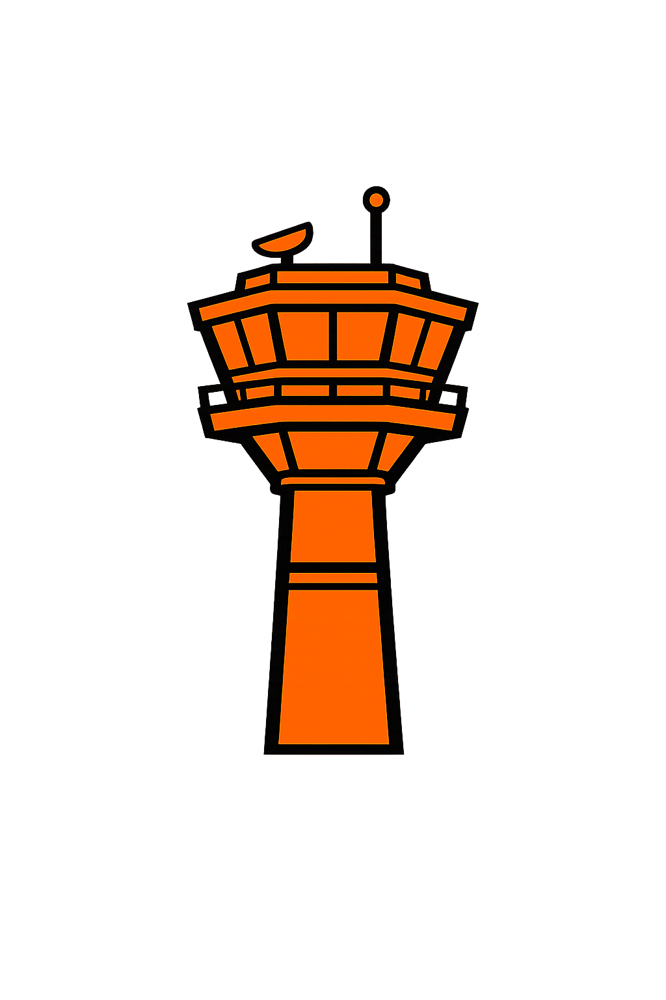
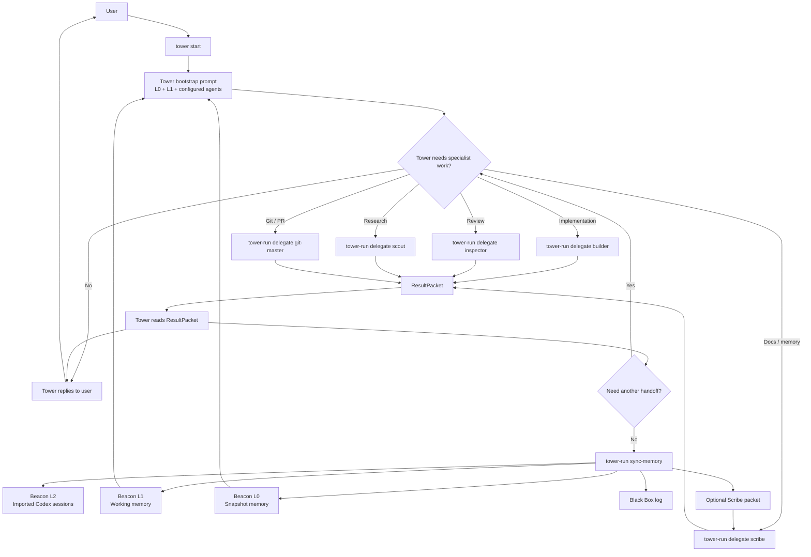

#  Control Tower

Control Tower is a bootstrap for a Codex-driven multi-agent orchestration workflow.

It installs a `tower` command for humans and a `tower-run` command for Tower’s internal runtime operations. Together they wrap OpenAI Codex CLI, initialize a project-local `.control-tower/` runtime, load Tower with persistent project memory, and provide delegated subagent entrypoints for:

- `Builder`
- `Inspector`
- `Scout`
- `Git-master`
- `Scribe`

## What this bootstrap does

- Creates a portable `.control-tower/` directory inside any repo you run `tower` in.
- Opens an init-time CLI setup flow so you can enable, disable, and tune the available subagents for a repo.
- Starts Codex with a Tower-specific bootstrap prompt that includes project memory and agent contracts.
- Persists project memory in three tiers:
  - `L0`: fast snapshot
  - `L1`: working summary
  - `L2`: imported Codex session logs
- Imports Codex session JSONL files from `~/.codex/sessions` into project memory.
- Gives Tower a concrete delegation path via `tower-run delegate <agent> --packet <file>`.

## Quickstart

Clone this repo, then run:

```bash
./setup.sh
```

That installs `tower` and `tower-run` into `~/.local/bin/`.

If you want a one-line remote install instead of cloning first:

```bash
curl -fsSL https://raw.githubusercontent.com/yashturkar/control-tower/main/scripts/bootstrap_remote_install.sh | bash
```

That command:

- clones or updates Control Tower under `~/.local/share/control-tower/repo`
- installs `tower` and `tower-run`
- leaves the local clone available for future updates

Inside any Git repo:

```bash
tower init
tower start
```

`tower init` opens a small CLI configuration flow where you can choose which subagents are enabled and set per-agent defaults like sandbox, web search, and an optional model override.

Resume the last Tower session for the current repo:

```bash
tower resume
```

Inspect project state:

```bash
tower status
```

Low-level runtime example:

```bash
tower-run create-packet builder \
  --title "Implement feature X" \
  --objective "Add feature X and tests" \
  --instruction "Modify the relevant source and tests" \
  --expected-output "Updated source and tests" \
  --definition-of-done "Feature X works and tests pass"

tower-run sync-memory --emit-scribe-packet
```

## Expected project layout

After `tower init`, the target repo gets:

```text
.control-tower/
  agents/
  docs/
  logs/
  memory/
  packets/
  schemas/
  state/
```

The files are intended to be committed with the target repo so Tower can carry context across machines and collaborators.

## Delegation model



Tower is intentionally non-coding. It delegates by creating a task packet and running:

```bash
tower-run create-packet builder \
  --title "Implement feature X" \
  --objective "Add feature X and tests" \
  --instruction "Modify the relevant source and tests" \
  --expected-output "Updated source and tests" \
  --definition-of-done "Feature X works and tests pass"

tower-run delegate builder --packet .control-tower/packets/outbox/task.json
```

Subagents run through `codex exec` with their own prompt, policy, and packet context. Their output is constrained to the ResultPacket schema.

The intended loop is:

1. Tower creates a TaskPacket.
2. Tower delegates to a subagent.
3. The subagent returns a ResultPacket.
4. Tower reads that ResultPacket, reports progress or success to the user, and decides whether to hand off to another subagent.
5. After the chain is complete, Tower syncs memory and optionally routes durable curation to Scribe.

For chained work, Tower can seed the next packet from the previous ResultPacket. Example: Builder finishes implementation, then Tower creates a Git-master packet from that Builder result, delegates Git-master, then creates a Scribe packet from the Git-master result.

```bash
tower-run create-packet git-master \
  --from-result .control-tower/packets/inbox/builder-result.json \
  --title "Commit Builder changes" \
  --task-type "git-operations" \
  --objective "Review the Builder output, stage the intended files, and create a commit" \
  --instruction "Use the Builder result packet as the source of truth for changed files" \
  --expected-output "Commit hash and commit summary" \
  --definition-of-done "Relevant changes are committed cleanly"
```

## Memory sync model

`tower-run sync-memory` scans the local Codex session store and imports sessions whose `cwd` matches the current project root. Imported sessions are copied into `.control-tower/memory/l2/sessions/`, a transcript index is maintained in `.control-tower/state/session-index.json`, and deterministic `L0` and `L1` summaries are refreshed.

For higher-quality persistent memory, use `tower-run sync-memory --emit-scribe-packet`. That creates a Scribe task packet so Tower can delegate long-form curation of:

- session summaries
- open questions
- task ledgers
- architecture notes
- ADR/doc drift

## Requirements

- `python3` 3.9+
- `codex` installed and authenticated
- a writable `~/.local/bin` on your `PATH`

## Notes

- `tower` is the intended user interface.
- `tower-run` is the intended internal interface for Tower’s own orchestration primitives.
- `tower resume` prefers the last tracked Tower session for the current repo. If none is recorded, it falls back to `codex resume --last`.
- The bootstrap uses only the Python standard library.
- The repo includes JSON schemas and prompt/policy templates, but the runtime is intentionally lightweight so it can be used as a starting point and extended.
